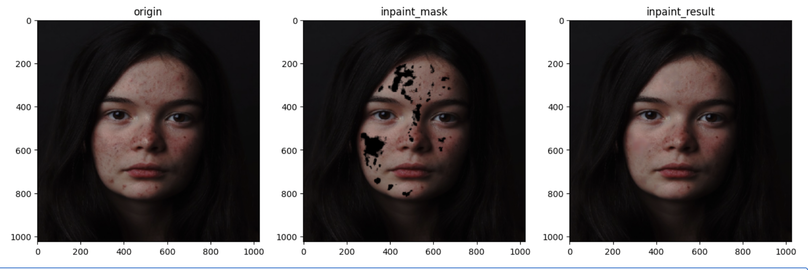

# local_retouch

Detect face defect areas and retouch through inpainting. 

As shown in the following image, many defects are removed through the local retouch processing.

The input_mask is predicted by the detector model, and the inpaint_result is generated by the inpainting model.



## inference
1. Download the pretrained weights from [google driver](https://drive.google.com/drive/folders/1G7iWXllu3yI3nWjJSD3XpTsXzCqyt_VF?usp=sharing "可选的标题")
and place in pretrain_checkpoints. 
2. run the detecting and inpaiting demo in demo_joint.ipynb.

## train
1. download the [ffhq](https://github.com/NVlabs/ffhq-dataset) and [ffhqr](https://github.com/skylab-tech/ffhqr-dataset) datasets and place in the dir "data" as follows.
```
"data/ffhq"
"data/ffhqr"
```
2. run the skin detector script to generate the skin detecton for each image, which will be placed in "data/skins"
```
python masks.py
```
3. run the script joint_trainer.py to train the detector and the inpainting model simultaneously. 
```
mkdir -p checkpoints
python joint_trainer.py
```
the detector and inpainting model will be cached in checkpoints dir.


## acknowledgements
We thank the following projects for their work that enabled us to collect the data and define the network.
1. [skin_retouching](https://github.com/modelscope/modelscope/tree/master/modelscope/models/cv/skin_retouching) for detection and inpainting network and related processing utils
2. [DiceLoss](https://github.com/hubutui/DiceLoss-PyTorch/blob/master/loss.py)
3. [total variation Loss](https://github.com/jxgu1016/Total_Variation_Loss.pytorch)
4. [CodeFormer](https://github.com/sczhou/CodeFormer)
